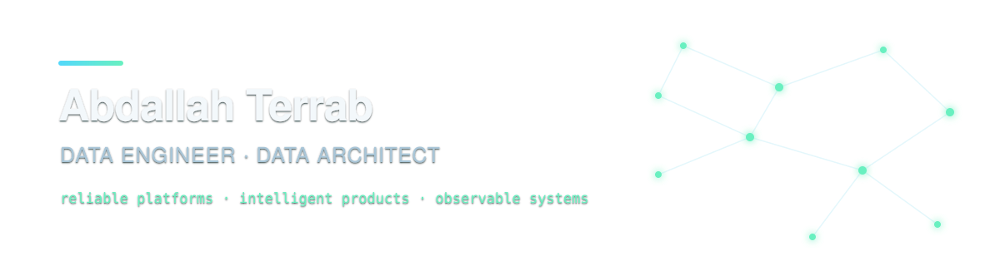
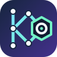

<picture>
  <source media="(prefers-color-scheme: dark)" srcset="./assets/profile-banner-dark.svg">
  
</picture>

I build data platforms and intelligent products that connect reliable pipelines,
clear architecture, useful interfaces, and operational reality.

## What I am building

<table>
<tr>
<td width="50%" valign="top">

###  K0

**From issue to verified pull request.**

K0 coordinates durable repository-role workflows. It authorizes work, snapshots
the committed workflow, invokes AI or human roles, validates evidence, follows
explicit graph edges, and keeps human review at the closing boundary.

`work in progress` · **open-source release coming**

</td>
<td width="50%" valign="top">

###  Atomic Accounting

**Exact accounting with an auditable agent boundary.**

An independently installable accounting kernel for immutable double-entry
records, evidence-backed proposals, human approval, receipt-safe posting,
reproducible statements, and typed access for applications and agents.

`work in progress` · **open-source release coming**

</td>
</tr>
</table>

## Data engineering and agentic systems.

Data engineering is the foundation of my work: ingestion and transformation,
orchestration, data contracts, catalog identities, lineage, quality, governed
access, and the cloud platforms that keep those capabilities dependable.

I am interested in agents that can do meaningful work **without making authority
ambiguous**. That means explicit roles, typed tools, least-privilege access,
durable state, resumable execution, observable events, verifiable evidence, and
human checkpoints where judgment or irreversible action begins.

My recent work connects agent orchestration with real platform boundaries:
metadata discovery, document consultation, controlled read-only SQL, delegated
specialists, asynchronous tool execution, usage accounting, and failure-aware
client events.

## Experience

<table>
<thead>
<tr><th>Period</th><th colspan="2">Role and focus</th></tr>
</thead>
<tbody>
<tr>
<td width="105"><strong>2021&#8209;now</strong></td>
<td width="112" align="center" valign="middle"></td>
<td><strong>Decathlon Technology - Data Architect &amp; Data Engineer Consultant.</strong> Customer analytics and Customer 360; privacy and GDPR-aware ingestion, feature engineering, behavioral analysis, dashboards, and recommendation pipelines. Data-platform architecture spanning batch and streaming systems, observability, OpenLineage and Marquez, metadata, catalog identities, data contracts, quality, governed discovery, and controlled data access. Requirements, roadmaps, technical reviews, CI/CD, reliability, mentoring, and knowledge sharing. Delivered +15 professional Spark, Airflow, and dbt training sessions to +150 participants.</td>
</tr>
<tr>
<td><strong>2022&#8209;now</strong></td>
<td align="center" valign="middle"></td>
<td><strong>TID Consultancy - Founder &amp; CEO.</strong> Data and cloud architecture, AI integration, governance, mentoring, and delivery.</td>
</tr>
<tr>
<td><strong>2022&#8209;now</strong></td>
<td align="center" valign="middle"> </td>
<td><strong>Realift &amp; WOA - CTO / Co-Founder; Head of ML / Solution Architect.</strong> Measurement and size-recommendation services, AWS/ML architecture, personalized-footwear commerce, and production workflows.</td>
</tr>
<tr>
<td><strong>2020&#8209;2022</strong></td>
<td align="center" valign="middle"></td>
<td><strong>ESEM Paris - Master 2 Big Data &amp; AI Lecturer.</strong> Lectures, practical classes, projects, and assessments.</td>
</tr>
<tr>
<td><strong>2017&#8209;2021</strong></td>
<td align="center" valign="middle"></td>
<td><strong>Total - Data Scientist &amp; Data Engineer.</strong> Pricing, revenue management, customer analytics, recommendations, data APIs, and industrial analytics.</td>
</tr>
<tr>
<td><strong>2016&#8209;2017</strong></td>
<td align="center" valign="middle"></td>
<td><strong>LIMOS - R&amp;D Engineer.</strong> Graph optimization, routing and spectrum assignment, scientific computing, and parallel systems.</td>
</tr>
<tr>
<td><strong>2015&#8209;2016</strong></td>
<td align="center" valign="middle"></td>
<td><strong>JPI-Conseil - Java &amp; Android Developer.</strong> Medical-team applications, APIs, SQL, tests, and user workshops.</td>
</tr>
</tbody>
</table>

## Open source

- **[OpenLineage](https://github.com/OpenLineage/OpenLineage)** - merged contributions for [Spark adaptive plans](https://github.com/OpenLineage/OpenLineage/pull/2061), [catalog identities](https://github.com/OpenLineage/OpenLineage/pull/2379), [lineage logging](https://github.com/OpenLineage/OpenLineage/pull/2769), and [Spark UI / Databricks configuration](https://github.com/OpenLineage/OpenLineage/pull/3251).
- **[Marquez](https://github.com/MarquezProject/marquez)** - merged [SQL pagination and JobDao work](https://github.com/MarquezProject/marquez/pull/2609).
- **K0** - durable human-and-agent software-delivery workflows; **coming to open source**.
- **Atomic Accounting** - evidence-backed, agent-accessible accounting infrastructure; **coming to open source**.

## Talks and teaching

- **[From PoC to viable product: industrializing a Big Data project](https://www.linkedin.com/posts/decathlondigital_data-project-engineer-activity-6934889342985281536-KdJt)** - DevFest Lille, 2022
- **[OpenLineage in Action: A Catalyst for Data Observability](https://www.meetup.com/london-openlineage-meetup-group/events/298420417/)** - OpenLineage × Apache Kafka at Confluent London, 2024
- Former Master 2 Big Data & AI lecturer at **ESEM Paris**
- Delivered professional **Airflow, Spark, and dbt** training across +15 sessions to +150 participants

## Technology

  &nbsp;
  &nbsp;
  &nbsp;
  &nbsp;
  &nbsp;
  &nbsp;
  &nbsp;
  &nbsp;
  &nbsp;
  &nbsp;
  &nbsp;
  &nbsp;
  &nbsp;
  &nbsp;
  &nbsp;
  &nbsp;
  

  &nbsp;
  &nbsp;
  &nbsp;
  &nbsp;
  &nbsp;
  &nbsp;
  &nbsp;
  &nbsp;
  &nbsp;
  &nbsp;
  &nbsp;
  &nbsp;
  &nbsp;
  &nbsp;
  &nbsp;
  &nbsp;
  &nbsp;
  &nbsp;
  

  &nbsp;
  &nbsp;
  &nbsp;
  &nbsp;
  &nbsp;
  &nbsp;
  &nbsp;
  &nbsp;
  &nbsp;
  &nbsp;
  &nbsp;
  &nbsp;
  &nbsp;
  &nbsp;
  

  &nbsp;
  &nbsp;
  &nbsp;
  &nbsp;
  &nbsp;
  &nbsp;
  &nbsp;
  &nbsp;
  &nbsp;
  &nbsp;
  

| Area | Technologies and practices |
| --- | --- |
| **Languages and formats** | Python · SQL · Scala · TypeScript · JavaScript · Java · C · C++ · Fortran · PHP · Bash · MATLAB · YAML · XML · JSON · PDF processing |
| **Data engineering** | PySpark · Apache Spark · Hadoop · Hive · Airflow · MWAA · Kafka · dbt · Talend for Big Data · Dataiku · Google Cloud Data Fusion · Azure Data Factory · ETL/ELT · DataFrames · materialized views |
| **Data platforms and governance** | Databricks · Unity Catalog · AWS Glue · OpenLineage · Marquez · metadata platforms · data contracts · data quality · catalog identity reconciliation · dataset discovery · lineage · Gold/Silver/Insight models |
| **Cloud and storage** | AWS · Azure · GCP · S3 · EMR · Redshift · EKS · Lambda · SQS · SageMaker · DynamoDB · Azure Data Lake · BigQuery · PostgreSQL · MongoDB · Algolia |
| **Applications and APIs** | React · Next.js · FastAPI · Flask · Django · OpenAPI · DocAPI · REST APIs · SSO · Shopify · storefronts · back-office systems · web dashboards · Android |
| **Generative AI and agents** | LLMs · AWS Bedrock · LangGraph · LangChain · LiteLLM · MCP · tool calling · multi-agent delegation · document search · controlled SQL access · token accounting · asynchronous execution · delegated event streaming |
| **Machine learning and analytics** | NumPy · pandas · SciPy · scikit-learn · TensorFlow · TensorFlow C++ · NLTK · NetworkX · BigQuery ML · Azure ML · clustering · collaborative filtering · recommendation systems · neural networks · Power BI · Google Data Studio · seaborn · Matplotlib |
| **Scientific computing** | MPI · graph algorithms · routing and spectrum assignment · linear and nonlinear optimization · parallel computing |
| **Platform engineering** | Docker · Kubernetes · EKS · FluxCD · Kustomize · nginx · IAM · GitHub Actions · Jenkins · ECR · CodeArtifact · Nexus · Code Factory · Vault · Checkmarx · CloudWatch · CI/CD · observability · logging · alerting |
| **Testing and reliability** | TDD · unit testing · integration testing · pytest · AsyncMock · asyncio · Vitest · Testing Library · typed interfaces · immutable records · receipt-safe retries · reproducible builds |
| **Delivery and collaboration** | Git · GitHub · Bitbucket · Jira · Confluence · Linux · technical specifications · architecture reviews · evidence-backed delivery |
| **Business systems and sources** | SAP · Lisa · Shopify · e-commerce and order workflows · pricing and revenue-management data · customer analytics |

---

<strong>Building systems that stay understandable after the prototype.</strong>

